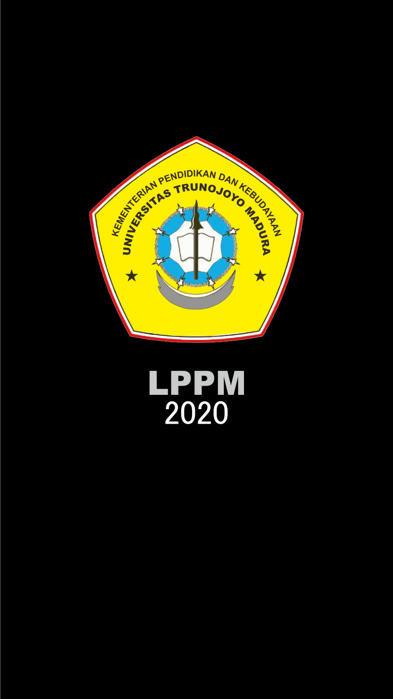
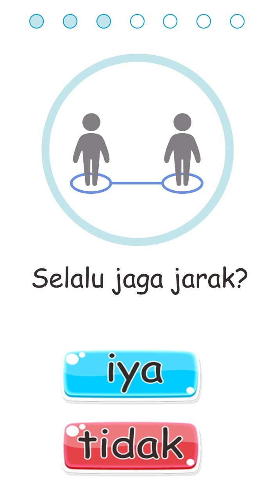

# QUICK TEST

Oleh:  

**MOCHAMAD SALIM UBAIDILLAH**

## KULIAH KERJA NYATA

TEMATIK “ADAPTASI KEBIASAAN BARU” SEMESTER GASAL TAHUN AKADEMIK 2020/2021 

LEMBAGA PENELITIAN DAN PENGABDIAN KEPADA MASYARAKAT 

UNIVERSITAS TRUNOJOYO MADURA 

Jl. Raya Telang PO BOX. 2 Kamal Bangkalan 69162 Telp. (031) 3012391 

Laman: http://lppm.trunojoyo.ac.id Email: lppm@trunojoyo.ac.id

  

## Tentang Aplikasi
- Pengembang :

  Mochamad Salim Ubaidillah

  170411100097 - Teknik Informatika

- Tahun Pembuatan : 2020, December

- Kelompok : 67

  Desa : Gembong

  Kecamatan : Babat

  Kabupaten : Lamongan

  Provinsi : Jawa Timur

- Dosen Pembimbing Lapangan :

  Muttaqin Choiri,M.Hi (NIDN. 2126098401)

### Tampilan

 

 

 

### Unduh

Klik untuk mengunduh

[Link 1: Google Drive](https://drive.google.com/file/d/1yhWEZyIpGwOsaGDK1VsZWnxVgOHo88Ak/view?usp=sharing)

[Link 2: Desktop](https://github.com/salimubet/LPPM-UTM-2020/raw/main/Quick-Test-LPPM-UTM-2020-K67.apk)

[Link 3](https://github.com/salimubet/LPPM-UTM-2020/blob/main/Quick-Test-LPPM-UTM-2020-K67.apk?raw=true)

### Cara Install

1. Setelah unduhan (*download*) selesai klik pada aplikasi.
2. Buka Pengaturan di ponsel Anda dan beralih ke tab "umum", jika perlu.
3. Ketuk opsi "Keamanan". Pilih kotak centang di sebelah opsi "Sumber Tidak Dikenal".
4. Konfirmasikan pesan peringatan dengan mengetuk "OK".
5. Untuk lebih jelas [klik disini.](https://www.google.com/search?q=cara+install+aplikasi+android+pihak+ke+tiga&oq=cara+install+aplikasi+android+pihak+ke+tiga&aqs=chrome..69i57j33i22i29i30.16356j0j4&sourceid=chrome&ie=UTF-8)

 

> Catatan: Aplikasi hanya berjalan pada OS **Android**

